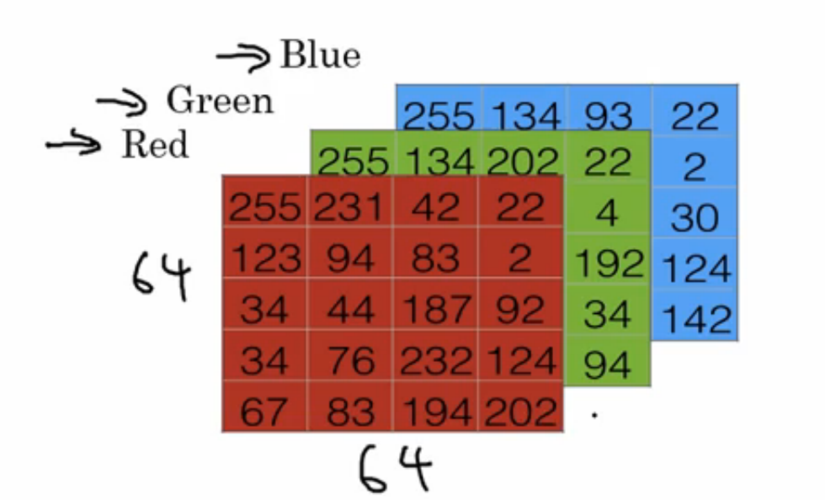

# Basic Knowledge
## 在学习本章之前，你需要掌握以下基础知识：
掌握C++基本语法和基础算法思维；  
了解C++面向对象开发的思维；  
了解C++程序的编译过程；  
掌握矩阵运算基本常识；
了解图像是如何储存在文件中的；
了解数据的储存形式。

## 你需要在本章节学会以下内容:  
使用CMake配置项目；\
从/向磁盘读取、写入图像；\
读取视频和访问相机设备；\
主要图像结构；\
基本矩阵运算简介；\
使用XML/YAML储存OpenCV API进行文件储存操作。  
  
如果上述条件你都满足，那么现在让我们开始吧！
  
## 基本CMake配置文件
CMake使用名为CMakeLists.list的配置文件，用来定义编译和依赖关系过程。
如：
```cmake
#规定CMake最低版本
    cmake_minimum_required(VERSION 3.0)
#定义项目名为HELLO
    project(HELLO)
#将Hello.cpp编译为二进制文件
    ADD_EXECUTABLE( hello Hello.cpp )
```

----------

## 管理依赖项
CMake具备搜索依赖项和外部库的能力，这使我们能够根据项目中的外部组建构建复杂的项目。
现在我们将OpenCV添加到我们的所有项目中：
```cmake
cmake_minimum_required(VERSION 3.0)
project(HELLO)
#Requires OpenCV（找包）
    FIND_PACKAGE(OpenCV REQUIRED)
#Show a message with the opencv version detected
    MESSAGE("OpenCV version : ${OpenCV_VERSION}")
#Add the paths to the include directories/to the header files（包含相关头文件的目录）
    include_directories(${OpenCV_INCLUDE_DIRS})
#Add the paths to the compiled libraries/objects（指定第三方库的路径）
    link_directories(${OpenCV_LIB_DIR})
#Create a variable called SRC
    SET(SRC "Hello.cpp")
#Create our executable
    ADD_EXECUTABLE( hello ${SRC} )
#Link our library    
    TARGET_LINK_LIBRARIES( hello ${OpenCV_LIBS})
```
SET函数用于创建一个新变量，并向其添加我们需要的任何值。在这个例子中，我们将Hello.cpp值合并到SRC变量中，SET函数还可用来向变量中添加多个文件中的值，如：
```
SET(SRC main.cpp
        utils.cpp
        color.cpp
)
```
其中的SET指令可以通过FILE指令更高级的实现，如：
```cmake
#通过FILE指令将src目录下的cpp文件、include目录下的h、hpp文件、cxx_src变量收入GLOB_RECURSE中
file(GLOB_RECURSE cxx_src "src/*.cpp" "include/*.h" "include/*.hpp")
```
如果Cmake没有找到OpenCV包，就会返回错误，但这并不会阻止我们编译应用程序。MESSAGE函数在终端中会显示一条消息，在这个例子中，就显示：
```
OpenCV version : 4.1.1
```
`${OpenCV_VERSION}`使用来储存OpenCV包版本的变量。include_directoried()和link_directories()向环境中添加制定库的头文件和路径。OpenCV Cmake模块将这些数据保存在`${OpenCV_INCLUDE_DIRS}`和`${OpenCV_LIB_DIR}`变量中。  

--------

## 图像与矩阵
在计算机中，图片只是以矩阵格式储存的一系列数字。图像中的每个点都称为像素，并且每个像素可以存储一个值或多个值，这取决与它是否仅储存一个值的黑白图像，还是储存两个值的灰度图像，或者是存储三个值的彩色图像。这些值通常在整数0～255。  
图像是以矩阵格式储存的，其中的每个像素都有一个位置，并且可以通过行和列的编号来引用。OpenCV用Mat类来达到这个目的。在灰度图像中，使用单个矩阵。  

  

--------

## 读、写图像
下面我们来看一下利用OpenCV如何读取图像：
```c++
#include <iostream>
#include <string>
#include <sstream>
using namespace std;

//包含OpenCV相关头文件
#include "opencv2/core.hpp"
#include "opencv2/highgui.hpp"
using namespace cv;

int main ( int argc , const char** argv )
{ 
    //将Mat类实例化为color和gray
    Mat color = imread("index.jpg");
    Mat gray= imread("index.jpg", 0);

    //在终端内输出矩阵的行、列
    cout << color.rows<<"*";
    cout << color.cols<<endl;

    //将gray对象写入lenaGray.jpg
    imwrite("lenaGray.jpg",gray);

    //减1防止数组越界
    int myRow = color.cols-1;
    int myCol = color.rows-1;

    //8位彩色图像中的类型名称为Vec3b类，它储存三个无符号字符数据（Vec=向量，3=组件数，b=一个字节）
    //定义一个Vec3b类的对象pixel，获取color中最后一个像素点的值
    Vec3b pixel=color.at<Vec3b>(myRow,myCol);
    cout << "Pixel value (B,G,R): ("<< (int)pixel[0] << "," << (int)pixel[1] << "," <<(int)pixel[2] <<")"<< endl;

    //显示图片
    imshow("Lena BGR",color);
    imshow("Lena Gray",gray);

    //等待敲击键盘
    waitKey(0);
    return 0;
}
```   
----------------

## 读取摄像头
下面的代码介绍了一个简单的摄像头读取示例：
``` c++
#include <iostream>
#include <string>
#include <sstream>
using namespace std;

#include "opencv2/core/core.hpp"
#include "opencv2/highgui/highgui.hpp"
//imgproc.hpp包含相关头文件
#include "opencv2/imgproc/imgproc.hpp"
using namespace cv;

int main()
{
	//读取视频或摄像头
	VideoCapture capture(0);
	
    //永真循环，即摄像头一直保持打开
	while (true)
	{
		Mat frame;
		capture >> frame;
        //将capture捕获的图像写入frame中。
		imshow("读取视频", frame);
		if (waitKey(1) == 27)//按ESC键
            {
                cout << "程序结束！" << endl;
                cout << "*** ***" << endl;
                //break时，循环结束，窗口关闭。
				break;
            }
	}
	return 0;
}
```
## 读取一段视频
下面的代码介绍了一个读取一个avi视频的简单示例：
```c++
#include <iostream>
#include <string>
#include <sstream>
using namespace std;

#include "opencv2/core/core.hpp"
#include "opencv2/highgui/highgui.hpp"
#include "opencv2/imgproc/imgproc.hpp"
using namespace cv;

int main()
{
    VideoCapture capture;
    //打开avi文件，注意，必须要让程序能够找到视频文件！必须给出文件的相对路径或绝对路径！还有，OpenCV不支持打开mp4格式文件。
    capture.open("../sample.avi");

    while(true)
    {
        Mat frame;
        capture>>frame;
       //注意要进行有效性检测
       if(!cap.isOpened())
            return;
        //如果某帧为空就结束循环，注意，此步骤需要放在imshow之前，否则会报错。（为什么？）
        if (frame.empty())
        {
            cout << "**** ****"<<endl;
            cout << "播放结束"<<endl;
            cout <<endl;
            cout << "**** ****"<<endl;
            break;
        }
        imshow("读取视频",frame);
        waitKey(30);
    }
    //释放资源
    capture.release();
}
```
-------
## 其他基本对象类型
我们上面介绍了Mat类和Vec3b类，下面再来介绍另外几种基本对象类型。
### Vec对象类型
一个主要用于数值向量的模板类。我们可以定义向量的类型和组建数量：
```c++
Vec<double,19> myVector;
```
我们还可以使用任何的预定义类型：
```c++
typedef Vec<uchar,2> Vec2b;
typedef Vec<uchar,3> Vec3b;

typedef Vec<short,2> Vec2s;

typedef Vec<int,2> Vec2i;

typedef Vec<float,2> Vec2f;

typedef Vec<double,2> Vec2d;
```
### Scalar对象类型
从Vec派生的模板类，有四个元素，广泛用于传递和读取像素值。  
访问Vec和Scalar之5，可以使用[]运算符，初始化的方法见下方代码：
```c++
Scalar s0(0);
Scalar s1(0.0,1.0,2.0,3.0);
Scalar s2(s1);
```
### Point对象类型
定义一个由其坐标x和y制定的2D点。  
与Vec类一样，OpenCV为方便起见定义了下面的Point别名：
```c++
typedef Point_<int> Point2i;
typedef Point2i Point;
typedef Point_<float> Point2f;
typedef Point_<double> Point2d;
```
### Size对象类型
Size类用于指定图像或矩阵的大小。这个类包含了两个成员width和height，以及area()函数，下面的代码会帮助你理解它：
```c++
Size s(100,100);
Mat img=Mat::zeros(s,CV_8UC1);
s.width=200;
int area=s.area(); //return 100*200
```
### Rect对象类型
用于定义由以下参数定义的2D矩形：  
左上角的坐标  
矩形的宽度和高度  
Rect模板类可用于自定义图像的感兴趣区域（Region of Interest，简称ROI），如：
```c++
Mat img=imread("lena.jpg");
Rect rect_roi(0,0,100,100);
Mat img_roi=img(r);
```

### RotatedRect对象类型
表示一个旋转矩形，该矩形由中心点、举行的宽度和高度以及单位为度的旋转角度决定：
```c++
RotatedRect(const Point2f& center,const Size2f& size,float angle);
```
_____
## 基本矩阵运算
刚才我们学习了如何加载图像并将其储存于Mat中，那么如何创建一个Mat对象呢？我们可以使用下面的代码：
```c++
Mat a =Mat (Size(5,5),CV_32F);
```
首先来解释一下CV_32F的含义：  
  
CV_8U,CV_16U,CV_16S,CV_32F,CV_64F都是OpenCV定义的数据类型。S=有符号整型  U=无符号整形  F=浮点型。  
  
如CV_8U表示八位无符号整数（0...255）。而后面的C1 C2 C3是什么意思呢？  
  
这里的1 2 3表示的是通道数。比如，RGB就是3通道，颜色表示最大为255，所以可以用CV_8UC3这个数据类型来表示；灰度图就是C1，只有一个通道；而带alph通道的PNG图像就是V4，是4通道图片。
  ____
  初始化不会设置数据的值，因此可能获得不需要的值。这时我们可以用0或1值及其各自的函数来初始化矩阵：
  ```c++
  Mat mz =Mat::zeros(5,5,CV_32F);//全为0
  Mat mo=Mat::ones(5,5,CV_32F);//全为1
  ```
还有一个特殊的初始化函数是eye函数，用于创建具有指定类型和大小的单位矩阵：
```c++
Mat m=Mat::eye(5,5,CV32F);
```
_____
学习了矩阵的初始化之后，我们需要对矩阵执行运算。
### 矩阵的加减
我们可以用+和-运算符来加上或减去两个相同大小的矩阵，代码如下：
```c++
Mat a=Mat::eye(Size(3,2),CV_32F);
Mat b=Mat::ones(Size(3,2),CV_32F);
Mat c=a+b;
Mat d=a-b;
```
你可以用你的线性代数知识进行运算。
### 矩阵的数乘
我们可以用*运算符乘以一个数，运行矩阵的数乘，代码如下：
```c++
Mat m1=Mat::eye(2,3,CV_32F);
cout << "nm1.*2n"<<m1*2<<endl;
```
### mul函数
我们对两个相同的矩阵使用mul函数，结果就是把每一个对应元素相乘得到一个新矩阵。
```c++
Mat m1=Mat::eye(2,3,CV_32F);
cout <<"n(m1+1).*(m1+3)n"<<(m1+1).mul(m1+3)<<endl;
```
### 矩阵乘法
本章默认读者已经了解线性代数基本概念，笔者不再赘述。直接看例子：
```c++
Mat m1=Mat::eye(2,3,CV_32F);
Mat m2=Mat::ones(3,2,CV_32F);
cout <<"nm1*m2n"<<m1*m2<<endl;
```

### 其他运算
其他常见的数学运算如转置、矩阵求逆，分别由函数t和函数inv定义。  
还有很多很实用的函数，如：  
  
计算非零元素countNonZero(src)  ；
  
使用meanStdDev函数计算通道的平均值和标准差：
```c++
meanStdDev(src,mean,stddev);
```
  
使用函数minMaxLoc查找矩阵或数组的最小值和最大值，该函数可以查找矩阵或数组的最小值和最大值，并返回位置和值：
```c++
minMaxLoc(src,minVal,maxVal,minLoc,maxLoc);
```
  
  注意，这里的src是输入矩阵，minVal和maxVal是检测到的最小值和最大值，minLoc和maxLoc是检测到的Point值。

----
## 基本数据储存
那么如何使用OpenCV来存储和读取数据呢？在很多时候，当我们完成大量计算后，我们需要保存计算后的结果，为此，OpenCV提供了XML/YAML持久层。

### 介绍FileStorage类
FileStorage类将各种OpenCV数据结构的数据存储为XML 或 YAML格式。同时，也可以将其他类型的数值数据存储为这两种格式。

### FileStorage类的构造函数
FileStorage类的构造函数为：
```c++
cv::FileStorage(const string& source, int flags， const string& encoding=string());
```
source –存储或读取数据的文件名（字符串），其扩展名(.xml 或 .yml/.yaml)决定文件格式。

flags – 操作模式，包括：  

FileStorage::READ 打开文件进行读操作  
FileStorage::WRITE 打开文件进行写操作  
FileStorage::APPEND打开文件进行附加操作  
FileStorage::MEMORY 从source读数据，或向内部缓存写入数据（由FileStorage::release返回）  

encoding – 文件编码方式。目前不支持UTF-16 XML 编码，应使用 8-bit 编码。
  
### 写数据operator <<
以下代码分别演示写入数值、矩阵、多个变量、当前时间和关闭文件：
```c++
    // 1.create our writter
	cv::FileStorage fs("test.yml", FileStorage::WRITE);
	
	// 2.Save an int
	int imageWidth= 5;
	int imageHeight= 10;
	fs << "imageWidth" << imageWidth;
	fs << "imageHeight" << imageHeight;
 
	// 3.Write a Mat
	cv::Mat m1= Mat::eye(3,3, CV_8U);
	cv::Mat m2= Mat::ones(3,3, CV_8U);
	cv::Mat resultMat= (m1+1).mul(m1+2);
	fs << "resultMat" << resultMat;
 
	// 4.Write multi-variables 
	cv::Mat cameraMatrix = (Mat_<double>(3,3) << 1000, 0, 320, 0, 1000, 240, 0, 0, 1);
    cv::Mat distCoeffs = (Mat_<double>(5,1) << 0.1, 0.01, -0.001, 0, 0);
    fs << "cameraMatrix" << cameraMatrix << "distCoeffs" << distCoeffs;
 
	// 5.Save local time
	time_t rawtime; time(&rawtime); //#include <time.h>
	fs << "calibrationDate" << asctime(localtime(&rawtime));
 
	// 6.close the file opened
	fs.release();
```

生成的文件test.yml:
```yml
%YAML:1.0
---
imageWidth: 5
imageHeight: 10
resultMat: !!opencv-matrix
   rows: 3
   cols: 3
   dt: u
   data: [ 6, 2, 2, 2, 6, 2, 2, 2, 6 ]
cameraMatrix: !!opencv-matrix
   rows: 3
   cols: 3
   dt: d
   data: [ 1000., 0., 320., 0., 1000., 240., 0., 0., 1. ]
distCoeffs: !!opencv-matrix
   rows: 5
   cols: 1
   dt: d
   data: [ 1.0000000000000001e-01, 1.0000000000000000e-02,
       -1.0000000000000000e-03, 0., 0. ]
calibrationDate: "Thu Mar 17 16:33:23 2022\n"
```
### 打开文件FileStorage::open
```c++
boolFileStorage::open(const string& filename, int flags, const string&encoding=string())
```
参数解释：


    filename – 待打开的文件名，其扩展名(.xml 或 .yml/.yaml) 决定文件格式(XML 或 YAML)

    flags – 操作模式。见构造函数

    encoding – 文件编码方式。

For example:
```c++
// open a file
	cv::FileStorage fs;
	fs.open("test.yml",FileStorage::WRITE);
// ... some process here
	fs.release();
```
### 检查文件是否打开FileStorage::isOpened
调用此函数，会返回一个bool值。


    true – 如果对象关联了当前文件；

    false – 其他情况。
### 释放缓存FileStorage::release
存储或读取操作完成后，需要关闭文件并释放缓存，调用
### 读数据FileStorage::operator[]
返回指定的顶层映射元素。
```c++
FileNode FileStorage::operator[](const string& nodename) const
FileNode FileStorage::operator[](const char* nodename) const
```
nodename – 文件节点名
For example:

```c++
    cv::FileStorage fs;
    fs.open("D:\\bb\\tt.yml", cv::FileStorage::READ);
    
    //读取普通数据
    int width;
    int height;
    fs["imageWidth"] >> width;//读取映射名为imageWidth的数据赋值给width
    fs["imageHeight"] >> height;
    std::cout << "width readed = " << width << std::endl;
    std::cout << "height readed = " << height << std::endl;

    //读取矩阵
    cv::Mat resultMatRead;
    fs["m1"] >> resultMatRead;//读取映射名为m1的矩阵赋值给resultMatRead  
    std::cerr << resultMatRead << std::endl;
    
    fs.release();
```
---
### 总结
写入yml文件的方式：首先，调用FileStorage构造函数并使用适当的参数、路径和FileStorage::WRITE来创建一个目标yml文件，通过流运算符<<将变量写入文件。  
读取yml文件的方式：首先，调用FileStorage构造函数并使用适当的参数、路径和FileStorage::READ来打开一个保存的文件。要读取任何的存储变量，只需要使用公共的流运算符>>并使用FileStorage对象和带[]运算符的标识符。
    
---
### HAVE A TRY！
下面我们来试着进行一个矩阵写入，要求如下：  
1.创建test.yml，写入一个名称为fps的整数。  
2.定义两个矩阵m1，为2行3列，数据类型为CV_32F。  
3.计算矩阵result，其中的每个元素为m1的每个元素+1乘以每个元素+3。  
4.将结果写入test.yml。  
5.读取test.yml中刚刚计算的result矩阵，并在屏幕上打印。
  
### 答案在project03中

